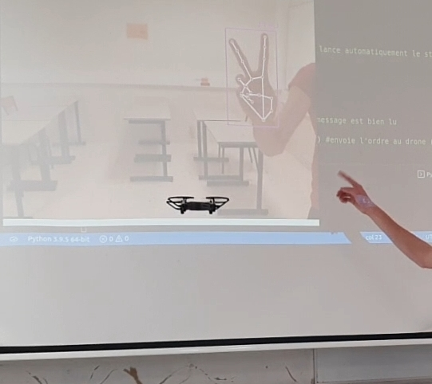

# tello_drone_image_recognition

Control a dji tello with the video feed

This project was made to participate in the NAE challenge 2021-2022, which pits student teams of drone pilots and programmers against each other for chosen tasks. It happens in Normandie, France.

We did gesture recognition and object tracking and came second out of twelve teams.
The code is still as it was during the short chalenge, I will comment / optimize it.

See the realisation on the link below :

https://youtu.be/VgfvO_IVpFU